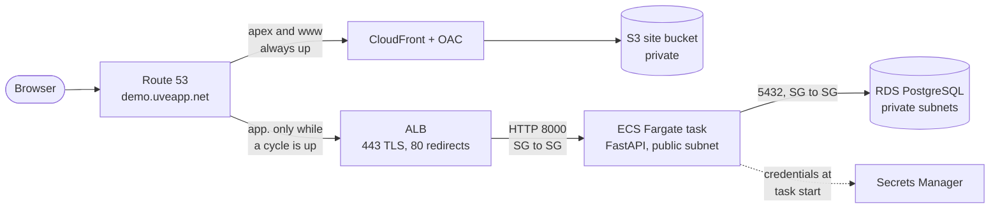
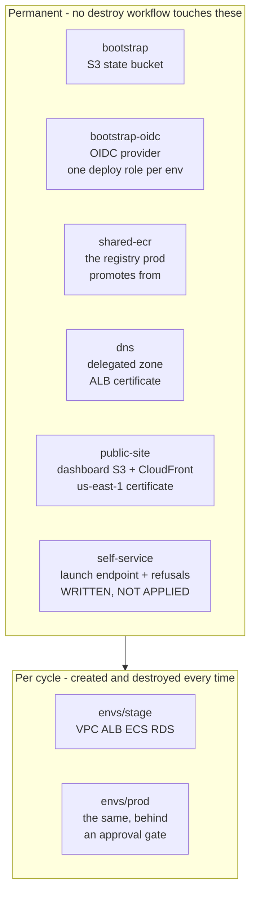
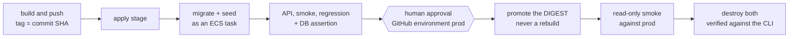

# Architecture

What exists, in what order it happens, and which trade-offs were made on
purpose. The decision records in `docs/decisions/` hold the reasoning; this file
holds the shape.

**Where the truth is.** The authoritative description of this system is the set
of directories under `infra/` and the workflows under `.github/workflows/`. This
page and the dashboard at https://demo.uveapp.net are two renderings of that,
kept deliberately short so they can be re-checked against the configuration
rather than trusted. When a diagram and a `.tf` file disagree, the `.tf` file
wins — go read the `.tf` file.

## The request path



Two names, two lifetimes. `demo.uveapp.net` is the dashboard and is always up.
`app.demo.uveapp.net` is prod and exists only while a cycle is running — a dead
name most of the time, by design (**ADR-0017** D2a).

Reading the path from the outside in:

```text
TLS          terminated on the ALB, certificate from ACM in us-west-2.
             Port 80 exists only to redirect to 443. stage has no certificate
             and stays plain HTTP; the module makes HTTPS optional so both
             shapes come out of the same code.
the task     runs in a PUBLIC subnet with a public IP, and accepts traffic only
             from the ALB's security group. See "why there is no NAT" below.
the database is not publicly accessible, sits in private subnets with no route
             to the internet, and accepts traffic only from the task's security
             group. Its password is generated by Terraform, stored in Secrets
             Manager and injected into the task definition by ARN — it is never
             in a variable file, an output, or a log line.
logs         CloudWatch, stream `app/app/<task-id>`. The prefix is `app`, so the
             stream name is not `ecs/app/<task-id>`; that cost a search once.
```

## The seven state levels

Six permanent, two per cycle. This split is the single most important line in
the design. The sixth, `infra/self-service`, is written and **not applied** -
Phase 19a; it is drawn below because `make tf-validate` discovers it and CI
validates it, not because anything in AWS answers for it yet.



**The exhibit cannot be destroyed by the thing it exhibits.** Three levels are
permanent for that one reason, each discovered later than it should have been:

```text
shared-ecr   ADR-0018. The registry held the image PROD WAS RUNNING while it
             lived in stage's state, so a stage teardown would have deleted it.
dns          ADR-0024. The hosted zone and the certificate outlive any
             environment; the alias record does not, and stays in envs/prod
             because it points at an ALB that is rebuilt every cycle.
public-site  ADR-0027. A dashboard inside envs/* would be deleted by the very
             teardown it exists to report on.
self-service ADR-0034. The lock, the day counter and the kill switch are state
             ABOUT a cycle, so a control living inside the environment it
             controls is destroyed by the thing it is controlling. Sixth
             arrival at the same rule, and the first from a spend control
             rather than from an artifact, a name or a pointer.
```

`infra/self-service` also holds the one long-lived credential in the project.
The claim elsewhere in these documents is "no static keys"; since ADR-0034 the
accurate version is **no static AWS keys anywhere, and exactly one static GitHub
credential** - a GitHub App private key in Secrets Manager, readable by one
Lambda execution role - because a button on a static page has to authenticate to
GitHub, and there is no OIDC in that direction.

Each level has its own remote state in the same S3 bucket, with
`use_lockfile = true` and no DynamoDB table. Root levels are **discovered**, not
listed: `make tf-validate` finds every directory containing `.tf` files outside
`infra/modules/` and fails loudly if it discovers none. A new level is therefore
validated the moment it exists — `infra/envs/prod` was invalid for seven weeks
while nothing looked at it.

## The lifecycle



Promotion carries a **digest**, not a tag: prod runs the exact bytes stage
tested. Rebuilding the same commit would produce a different artifact and turn
"tested in stage" from a fact into an assumption.

The approval gate has two independent halves and needs both:

```text
GitHub   the `prod` environment has required reviewers and allows only `main`,
         with administrator bypass off. This is UI state; git cannot assert it.
AWS      the prod deploy role trusts ONLY `environment:prod` and has no branch
         subject at all (ADR-0021). A workflow that skipped the environment
         could not authenticate, so the gate is not merely a convention.
```

## Identity, and why there are no keys

```text
humans          IAM Identity Center -> AWS CLI profile demo-admin.
                On the headless devbox: aws sso login --use-device-code.
                The default flow opens a callback on 127.0.0.1 that nothing
                there can reach.
CI              GitHub OIDC. One account-wide provider, one deploy role per
                environment, plus a narrow publish role for the dashboard that
                can reach exactly one bucket and one distribution.
the database    a Terraform-generated password in Secrets Manager, read by the
                task definition at start.
```

No static AWS access key exists in this repository, in GitHub Secrets, or on the
devbox. `docs/security-posture.md` records what a *public* repository does and
does not expose here, with the command to re-check each claim.

## What a 5xx looks like, and who notices

The application writes **one JSON object per request** to stdout, which the
`awslogs` driver puts into the environment's CloudWatch log group:

```json
{"ts":"2026-07-31T10:50:00.123Z","level":"info","msg":"request",
 "service":"aws-devops-sdet-demo","env":"stage","request_id":"3f2a...",
 "method":"GET","path":"/api/items/{item_id}","status":200,"duration_ms":12.4}
```

A metric filter over that group, `{ $.status >= 500 }`, feeds one alarm that
fires on a 5xx in any of the last five minutes. Three properties of the line are
load-bearing rather than cosmetic (**ADR-0032**):

```text
status is a NUMBER      the filter compares numerically; a quoted status makes
                        it a string comparison that matches nothing, forever,
                        while the alarm still looks configured
path is the TEMPLATE    /api/items/{item_id}, not the raw URL - a query string
                        can carry values a public log should not keep
one line per request    including the requests that RAISE. The middleware logs
                        status 500 and re-raises; an unhandled exception is the
                        most valuable 5xx there is and never reaches the
                        success path
```

The request id is taken from an inbound `X-Request-Id` when there is one and
generated otherwise, held in a context variable so anything logged during that
request carries it, and returned in the response header. A test can therefore
name the line it is about to cause. `X-Amzn-Trace-Id` is recorded alongside it,
never instead: it is the only value that ties a line to the ALB's own view, and
it does not exist locally, where most of the suite runs.

**This alarm reports the application, not the load balancer.** An ALB answering
503 because no target is healthy writes no application log line and will not
raise it — that is `HTTPCode_ELB_5XX_Count`, a second alarm that has not been
bought yet. And the alarm has no notification action: an SNS email subscription
must be confirmed by clicking a link, and an environment that is destroyed every
cycle would ask for that click every cycle. A notification channel has to
outlive what it reports on, which puts it at a permanent level.

`treat_missing_data` is `notBreaching` for a reason worth knowing: a metric
filter that matches nothing publishes **nothing**, not a zero. The default would
leave the alarm in INSUFFICIENT_DATA for its entire life — indistinguishable, on
sight, from an alarm nobody configured properly.

Two numbers here were set by measurement rather than by judgement. The filter
carries **no** `default_value`, because one emits a zero for every non-matching
event and the ALB health-checks this service every 30 seconds — the metric would
exist, and bill, from the first health check. And the alarm spans **five**
periods with one datapoint needed, because a single period was watched holding
ALARM for exactly sixty seconds; with no notification action, a state that brief
survives only in `describe-alarm-history`.

## Trade-offs made on purpose

### Why there is no NAT Gateway

A NAT Gateway costs roughly $32 a month whether or not anything is running,
which is more than everything else in this project combined. Instead the ECS
task runs in a public subnet with a public IP and is protected by its security
group, which admits only the ALB (**ADR-0006**).

This is a real trade-off, not a free lunch, and it has a price paid elsewhere —
see the next section. VPC endpoints are the cheaper alternative if it is ever
revisited; private subnets plus NAT is the textbook answer and was rejected on
cost, deliberately.

### Why the ALB is destroyed first

**ADR-0016.** Nothing in the configuration expresses a dependency between the
load balancer and the internet gateway, so Terraform is free to destroy them
concurrently — and does. The ALB's network interfaces are still attached when
the detach of the internet gateway is attempted, and AWS answers
`DependencyViolation`.

`destroy.yml` therefore runs a targeted destroy of the ALB module, and only then
the rest. The fix is ordering, in a workflow, because the race is between two
resources that have no reference to each other.

### Why prod keeps no data

Prod is created and destroyed with every cycle (**ADR-0017** D2a), so there is
nothing to keep. RDS needs 5-10 minutes to create, which sets a cycle at roughly
fifteen minutes to a live prod. Persistent prod data is an option with a written
price in `docs/next-phases.md`, not an oversight.

### Two certificates, two regions, one domain

CloudFront accepts a certificate only from **us-east-1**. An ALB accepts one
only from its own region, here **us-west-2**. So the same domain is covered
twice, by two certificates, and neither can be used in the other's place.

## How the dashboard knows anything

**ADR-0026.** Two sources, split by what each one can actually observe:

```text
the public Actions API   run history and per-STEP status of the current cycle.
                         It cannot know whether an environment exists in AWS.
status/<env>.json        written into the site bucket by the workflow that
                         observed AWS. It cannot know a run is in progress.
```

Each is the other's staleness detector. When they disagree — a destroy in
flight, nothing having observed AWS since — the page renders `unknown` and names
the run it is waiting for, rather than showing a value it cannot stand behind.
An absent status file reads as "no observation", never as "destroyed".

## What is deliberately absent

EKS, Helm, ArgoCD, a React frontend, a WAF, CloudFront in front of the
application, blue/green deploys, autoscaling, private ECS subnets with NAT, and
a second AWS account for prod. Each was considered and rejected with a reason;
the reasons are at the end of `docs/next-phases.md`.
